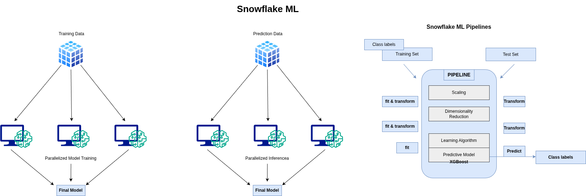

# Snowflake ML Inference Pipeline

An end-to-end machine learning pipeline built on Snowflake that demonstrates automated model training, registry management, and real-time inference on streaming data.




## 📋 Project Overview

This project implements a production-ready ML pipeline in Snowflake that predicts insurance charges based on customer attributes. The pipeline automatically trains models, versions them in a model registry, and performs real-time inference on incoming data streams.

### Key Features

- **Automated Model Training**: Scheduled training tasks that run every 8 days
- **Model Registry**: Version-controlled model artifacts with metrics tracking
- **Real-Time Inference**: Stream-based predictions on incoming data
- **Parallel Processing**: Leverages Snowflake's distributed compute for training and inference
- **Change Data Capture**: Uses Snowflake Streams to track and process new records
- **Automated Pipeline**: Tasks and stored procedures for end-to-end automation

## 🏗️ Architecture

### High-Level Data Flow

1. **Training Phase**
   - Source data (10,000 records) → Model Training → Model Registry
   - XGBoost model with GridSearchCV for hyperparameter tuning
   - Models stored with version control and performance metrics

2. **Inference Phase**
   - Incoming data → Landing Table → Stream → Model Inference → Gold Table
   - Real-time predictions as data arrives
   - Automatic updates for existing records

### Components

- **SOURCE_OF_TRUTH**: Training dataset (10,000 records)
- **INCOMING_DATA_SOURCE**: Simulated streaming data (990,000 records)
- **LANDING_TABLE**: Staging area for incoming records
- **STREAM_ON_LANDING**: Change data capture on landing table
- **INSURANCE_GOLD**: Final table with predictions
- **Model Registry**: Stores trained models with versioning

## 🚀 Getting Started

### Prerequisites

- Snowflake account with appropriate warehouse access
- Snowflake ML Python package
- Dataset: [Insurance Data for Machine Learning](https://www.kaggle.com/datasets/sridharstreaks/insurance-data-for-machine-learning)

### Installation & Setup

1. **Clone the repository**
```bash
git clone https://github.com/II-IronMan-II/Interference_Pipeline_Snowflake.git
cd Interference_Pipeline_Snowflake
```

2. **Create database and schema**
```sql
CREATE DATABASE INSURANCE;
CREATE SCHEMA ML_PIPE;
```

3. **Load the data**
   - Run the `data_load.ipynb` notebook in Snowflake
   - This loads the full dataset and splits it into training (10k) and incoming data (990k)

4. **Create the training stored procedure**
   - Execute `train_and_save.sql` to create the `TRAIN_SAVE_INS_MODEL` procedure

5. **Set up the pipeline**
   - Run `sql_to_build_pipeline.sql` to create:
     - Tables (LANDING_TABLE, INSURANCE_GOLD)
     - Stream (STREAM_ON_LANDING)
     - Event table for telemetry
     - Training task (TRAIN_SAVE_TASK)

6. **Create the prediction stored procedure**
   - Execute `predict_write_sproc.sql` to create the `PREDICT_WRITE_TO_GOLD` procedure

7. **Activate the prediction task**
```sql
CREATE OR REPLACE TASK PREDICT_WRITE_TASK
  WAREHOUSE = COMPUTE_WH
  SCHEDULE = '1 MINUTE'
  WHEN SYSTEM$STREAM_HAS_DATA('STREAM_ON_LANDING')
  AS CALL PREDICT_WRITE_TO_GOLD();

ALTER TASK PREDICT_WRITE_TASK RESUME;
```

## 📊 Model Details

### Features

The model uses the following features to predict insurance charges:

- **Demographics**: Age, Gender, BMI, Children
- **Health**: Smoker status, Medical History, Family Medical History
- **Lifestyle**: Exercise Frequency, Occupation
- **Insurance**: Region, Coverage Level

### ML Pipeline Steps

1. **Data Preprocessing**
   - One-Hot Encoding for categorical variables (Gender, Smoker, Region, etc.)
   - Value standardization (uppercase, remove special characters)
   - Missing value handling

2. **Model Training**
   - Algorithm: XGBoost Regressor
   - Hyperparameter tuning with GridSearchCV:
     - `n_estimators`: [50, 100, 200]
     - `learning_rate`: [0.01, 0.1, 0.5]
   - Scoring metric: Negative Mean Absolute Percentage Error
   - Train/test split: 80/20

3. **Model Evaluation**
   - Mean Absolute Percentage Error (MAPE)
   - Mean Squared Error (MSE)

4. **Model Registry**
   - Automatic versioning (major/minor versions)
   - Stores model artifacts, sample input data, and metrics
   - Default version management

## 🔄 Automated Tasks

### Training Task (TRAIN_SAVE_TASK)
- **Schedule**: Every 8 days (11520 minutes)
- **Function**: Trains a new model on SOURCE_OF_TRUTH data
- **Output**: New model version in registry with updated metrics

### Prediction Task (PREDICT_WRITE_TASK)
- **Schedule**: Every 1 minute
- **Trigger**: Only runs when new data is available in the stream
- **Function**: 
  - Reads new records from STREAM_ON_LANDING
  - Applies preprocessing transformations
  - Loads latest model from registry
  - Generates predictions
  - Writes results to INSURANCE_GOLD table

## 📁 Project Structure

```
├── data_load.ipynb                 # Notebook for initial data loading
├── train_and_save.sql             # Stored procedure for model training
├── predict_write_sproc.sql        # Stored procedure for inference
├── sql_to_build_pipeline.sql      # Complete pipeline setup
├── ML-Framework.png               # ML framework diagram
├── Architecture_HLD_.png          # High-level architecture diagram
└── README.md                      # This file
```

## 💡 Key Concepts

### Snowpark
Snowflake's implementation of Apache Spark, enabling Python/Scala code execution using Snowflake's compute resources.

### Model Registry
A centralized repository for ML models that provides:
- Model artifact storage
- Version control (V1, V1.1, V2, etc.)
- Sample input data storage
- Performance metrics tracking
- SQL and Python model access

### Streams
Snowflake's Change Data Capture (CDC) mechanism that tracks:
- INSERT operations
- UPDATE operations
- DELETE operations
- Metadata columns (METADATA$ACTION, METADATA$ROW_ID, METADATA$ISUPDATE)

### Stored Procedures
Server-side code execution in Snowflake with:
- Python runtime (3.11)
- Package dependencies (snowflake-ml-python, xgboost, pandas)
- Handler functions for business logic

## 🔍 Monitoring & Telemetry

The pipeline uses OpenTelemetry for comprehensive observability:

- **Event Table**: `MODEL_TRACES` captures all telemetry data
- **Tracked Spans**:
  - Data loading
  - Feature engineering
  - Pipeline definition
  - Model training
  - Model evaluation
  - Model registration
  - Prediction inference
  - Gold table writes

- **Metrics Tracked**:
  - Row counts
  - Model performance (MAPE, MSE)
  - Execution time per span
  - Error traces and stack traces

## 📈 Usage Examples

### Train a New Model
```sql
-- Manually trigger training
EXECUTE TASK TRAIN_SAVE_TASK;

-- Or call the stored procedure directly
CALL TRAIN_SAVE_INS_MODEL('SOURCE_OF_TRUTH', FALSE);
```

### Simulate Incoming Data
```sql
-- Insert records to trigger inference
INSERT INTO LANDING_TABLE
SELECT * FROM INCOMING_DATA_SOURCE LIMIT 100000;

-- Check stream for new data
SELECT COUNT(*) FROM STREAM_ON_LANDING;
```

### Run Predictions
```sql
-- Manually trigger prediction task
EXECUTE TASK PREDICT_WRITE_TASK;

-- Or call the stored procedure directly
CALL PREDICT_WRITE_TO_GOLD();

-- View results
SELECT * FROM INSURANCE_GOLD LIMIT 100;
```

### View Model Registry
```sql
-- See all models
SELECT * FROM INSURANCE.ML_PIPE.INFORMATION_SCHEMA.MODELS;

-- Get model versions
SHOW VERSIONS IN MODEL INSURANCE_CHARGES_PREDICTION;
```

## 🛠️ Advanced Configuration

### Adjusting Training Frequency
```sql
-- Change training schedule (e.g., daily)
ALTER TASK TRAIN_SAVE_TASK SET SCHEDULE = '1440 MINUTE';
```

### Adjusting Prediction Batch Size
```sql
-- Modify the LIMIT in sql_to_build_pipeline.sql
INSERT INTO LANDING_TABLE ... LIMIT 50000;  -- Change from 100000
```

### Model Version Control
```sql
-- Train a major version update
CALL TRAIN_SAVE_INS_MODEL('SOURCE_OF_TRUTH', TRUE);

-- Train a minor version update
CALL TRAIN_SAVE_INS_MODEL('SOURCE_OF_TRUTH', FALSE);
```

## 🧹 Cleanup

```sql
-- Suspend tasks
ALTER TASK PREDICT_WRITE_TASK SUSPEND;
ALTER TASK TRAIN_SAVE_TASK SUSPEND;

-- Drop database (optional - removes all data)
DROP DATABASE INSURANCE;
```

## 📚 References

- [Snowflake ML Documentation](https://docs.snowflake.com/en/developer-guide/snowpark-ml/index)
- [Snowpark Documentation](https://docs.snowflake.com/en/developer-guide/snowpark/index)
- [Original Implementation by tx-smitht](https://github.com/tx-smitht/sf-train-inference-pipeline)
- [Kaggle Dataset](https://www.kaggle.com/datasets/sridharstreaks/insurance-data-for-machine-learning)

## 🤝 Contributing

Contributions are welcome! Please feel free to submit a Pull Request.

## 📄 License

This project is for educational purposes. Please refer to the original repository for licensing information.

## 👤 Author

**II-IronMan-II**
- GitHub: [@II-IronMan-II](https://github.com/II-IronMan-II)

## 🙏 Acknowledgments

- Based on the excellent tutorial by [tx-smitht](https://github.com/tx-smitht/sf-train-inference-pipeline)
- Snowflake for providing comprehensive ML capabilities
- Kaggle for the insurance dataset

---

**Note**: This is a learning project demonstrating Snowflake's ML capabilities. For production use, consider additional error handling, security measures, and cost optimization strategies.
